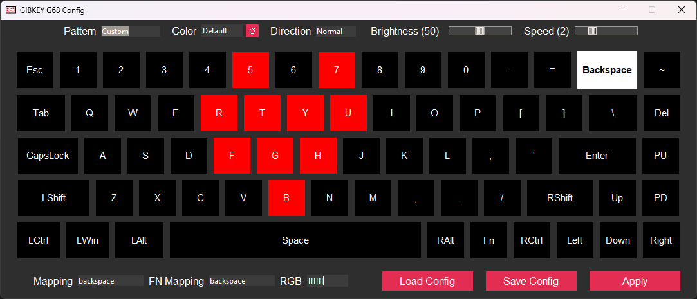

# GIBKEY G68 Config
A configuration tool for GIBKEY G68 keyboards. Remapping and RGB functions are fully supported, with a nice GUI!


## Usage
1. Download `gibkey-config.py` [from the releases section](https://github.com/mpaterakis/GIBKEY-G68-Config/releases/latest).
2. Place [libusb's DLL](https://github.com/libusb/libusb/releases/latest) in your python directory (next to python.exe/python3.exe).
3. Install `pyusb` (and `tkinter/ttk` if you want to use the GUI) using pip.
4. Connect the keyboard and make sure it's in wired mode (FN+Y)
5. Run the python file with no arguments to load into the GUI. You can also use the following arguments for extra functionality (`python gibkey-config.py <arguments>`):
```
  -h, --help            show this help message and exit
  -s, --silent          Shoosh.
  -p, --pattern PATTERN
                        Specify the lighting pattern (e.g., 'wave', 'static')
  -b, --brightness [0-100]
                        Set brightness level (0-100).
  -c, --color [000000-FFFFFF]
                        Set RGB color (000000-FFFFFF).
  -d, --direction [normal/reverse]
                        Set animation direction (normal/reverse).
  -sp, --speed [1-5]    Set animation speed (1-5).
  -kc, --key-color [key=color] [[key=color] ...]
                        Set inidividual key rgb (key=color). For example '-kc a=ffffff b=000000 enter=010101'
  -km, --key-map [key=mapped_key] [[key=mapped_key] ...]
                        Set inidividual key map (key=mapped_key). For FN mappings, append _fn to the key name. For example '-km a=up b=escape x=u pageup_fn=home'.
  --list-keys           List all usable key names.
  --list-patterns       List all usable pattern names.
  -o, --config-output <filepath>
                        Save the given config in a JSON file.
  -i, --config-input <filepath>
                        Load the config from a JSON file.
```

## Some history
When I ordered this keyboard, and before I had even received it, I noticed that the drivers mentioned a VID of 0x258A and a PID of 0x0049. This matched the Royal Kludge RKG68, the CIY X79 and other similar boards using sinowealth-based controllers.
When I received it, [I tried to dump its firmware](https://github.com/carlossless/sinowealth-kb-tool/issues/95), to no avail. I also tried [the open source utility for the RK keyboards](https://github.com/rnayabed/rangoli), which also failed to do much of anything, besides recognizing the device.

So I decided to follow rangioli's example and start sniffing USB packets via Wireshark. I've never done anything USB-related before, but was up for a fun challenge; and it worked! I managed to break down the different packets into their components (check the commit history to see them in the end of the script file), and after a LOT of trial and error I had the usb functionality fully reversed.

## What about other keyboards?
While I assume that this program will work with other 8051 (258A:0049) devices as well, it might need some tinkering. Specifically around the USB configuration part. This keyboard only receives data through interface 2 (MI_2), which might be different in other keyboards. Your mileage may vary.
